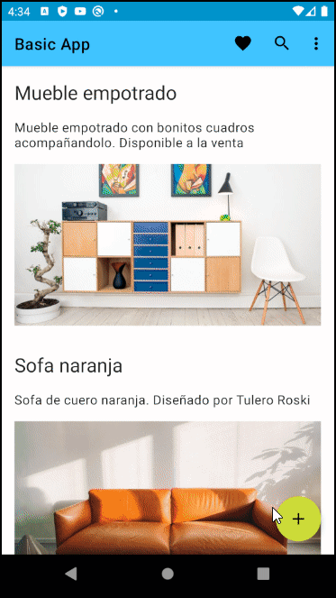

# Proyecto Básico Android

En este proyecto se tratarán temas básicos de Android con Kotlin.

## Contenido:

* [Toolbar](#toolbar)
* [Collapsing Toolbar](#collapsing-toolbar)
* [Navegación](#navegacion)
* [Agregar Item](#agregar-item)


### Toolbar

Chequear la rama Toolbar para revisar esta implementación

```
git checkout Toolbar
```


### Collapsing Toolbar

Chequear la rama Collapsing-Toolbar para revisar esta implementación

```
git checkout Collapsing-Toolbar
```


### Navegacion

Chequear la rama Navegacion para revisar esta implementación

```
git checkout Navegacion
```


### Agregar Item

Chequear la rama Add-Item para revisar esta implementación

```
git checkout Add-Item
```

En esta implementación se añade la funcionalidad de agregar items a nuestra lista. Debido a que aún 
no se implementa una base de datos todos los items nuevos solo están incluídos de forma temporal.

