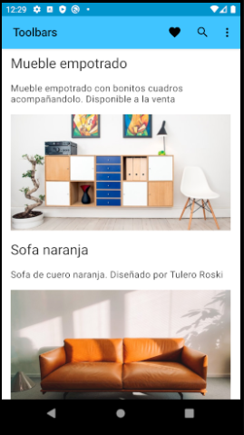
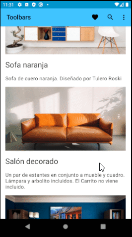

# Proyecto Básico Android

En este proyecto se tratarán temas básicos de Android con Kotlin.

## Contenido:

* [Toolbar](#toolbar)
* [Collapsing Toolbar](#collapsing-toolbar)
* [Navegación](#navegacion)


### Toolbar

Chequear la rama Toolbar para revisar esta implementación

```
git checkout Toolbar
```



### Collapsing Toolbar

Chequear la rama Collapsing-Toolbar para revisar esta implementación

```
git checkout Collapsing-Toolbar
```


### Navegacion

Chequear la rama Navegacion para revisar esta implementación

```
git checkout Navegacion
```

